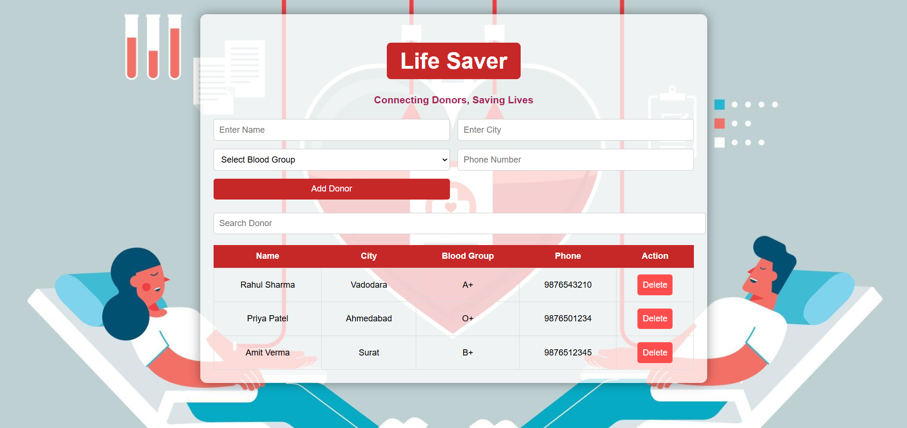

# ❤️ Life Saver

## Connecting Donors, Saving Lives

Life Saver is a beginner-friendly AngularJS web application designed to help users find and manage blood donors efficiently. The application provides an easy way to register blood donors, search donors by name, city, or blood group, and manage donor records through a simple and user-friendly interface.

---

## 🌐 Live Demo

🔗 **Project Website:**  
https://akshatraj2811.github.io/Life-Saver-AngularJS/

---

## 📂 GitHub Repository

🔗 https://github.com/akshatraj2811/Life-Saver-AngularJS

---

## 👨‍💻 Developer

**Akshat Raj**

GitHub Profile:  
https://github.com/akshatraj2811

---

# 📖 Project Overview

Blood donation is one of the most important ways to save lives during emergencies, surgeries, and medical treatments. Finding the right blood donor at the right time can often be challenging.

Life Saver is a simple web application developed using AngularJS that helps users maintain and search a list of blood donors. It demonstrates the basic concepts of AngularJS while addressing a real-world problem through an easy-to-use interface.

---

# ✨ Features

- Register new blood donors
- View all donor records
- Search donors by:
  - Name
  - City
  - Blood Group
- Delete donor information
- Responsive and user-friendly interface
- Attractive healthcare-themed background
- Clean and modern design
- Beginner-friendly AngularJS implementation

---

# 🛠️ Technologies Used

- HTML5
- CSS3
- JavaScript
- AngularJS 1.8.2

---

# 📚 AngularJS Concepts Used

- ng-app
- ng-controller
- ng-model
- ng-repeat
- ng-click
- filter
- Two-Way Data Binding
- Scope ($scope)
- Arrays
- CRUD Operations

---

# 📁 Project Structure

```text
Life-Saver-AngularJS/
│
├── README.md
├── background.jfif
├── index.html
├── screenshot.png
├── script.js
└── style.css
```

---

# 📸 Project Screenshot



---

# 🚀 How to Run the Project

### Clone the Repository

```bash
git clone https://github.com/akshatraj2811/Life-Saver-AngularJS.git
```

### Navigate to the Project Folder

```bash
cd Life-Saver-AngularJS
```

### Run the Project

Simply open the **index.html** file in any modern web browser.

No installation or additional software is required.

---

# 💡 Future Enhancements

- Edit donor details
- User Login and Registration
- Database Integration
- Blood Request Module
- Location-based Donor Search
- Mobile Responsive Improvements
- Email Notifications
- Dark Mode

---

# 🎯 Learning Outcomes

This project helped in understanding:

- AngularJS Fundamentals
- Dynamic Data Binding
- CRUD Operations
- Search Functionality
- Responsive Web Design
- HTML Forms
- CSS Styling
- JavaScript Functions
- User Interface Design

---

# 🎓 Project Objective

The primary objective of this project is to demonstrate how AngularJS can be used to develop interactive web applications while solving a real-world problem related to blood donation management.

---

# 📄 License

This project is developed for educational and learning purposes only.

You are free to use and modify this project for personal learning.

---

# 🙏 Acknowledgements

- AngularJS
- HTML5
- CSS3
- JavaScript
- GitHub Pages

---

# ❤️ Thank You

**Life Saver** is a small initiative to demonstrate how web technologies can contribute to solving real-life problems.

### ❤️ Connecting Donors, Saving Lives ❤️
